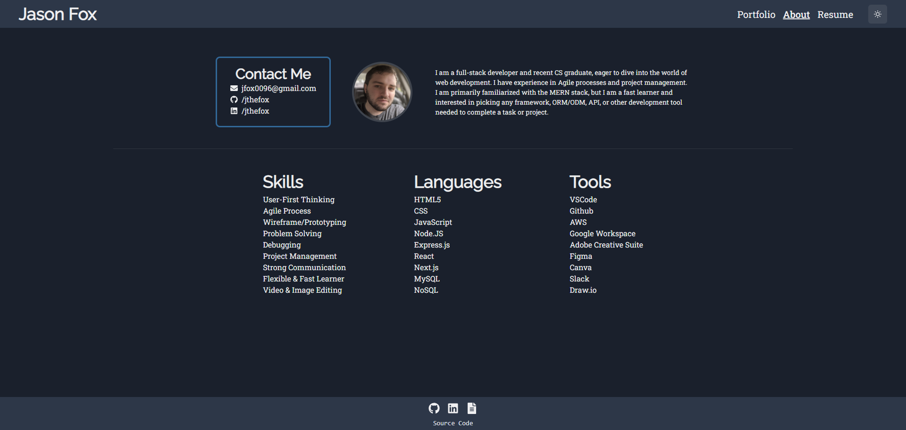

# My Portfolio Website

## ⛔️ DEPRECATED
**I redesigned my portfolio website in TypeScript. Go check out the [repository](https://github.com/JtheFox/portfolio) or the [live site](https://portfolio.jthefox.com)**

This is a `create-react-app` portfolio developed with [React](https://reactjs.org/), designed by myself using [Chakra UI](https://chakra-ui.com/), and deployed on [AWS Amplify](https://aws.amazon.com/amplify/). The design is a new iteration of the design I created for my [first portfolio](https://github.com/JtheFox/portfolio) built using raw HTML/CSS/JS.

## Visuals

